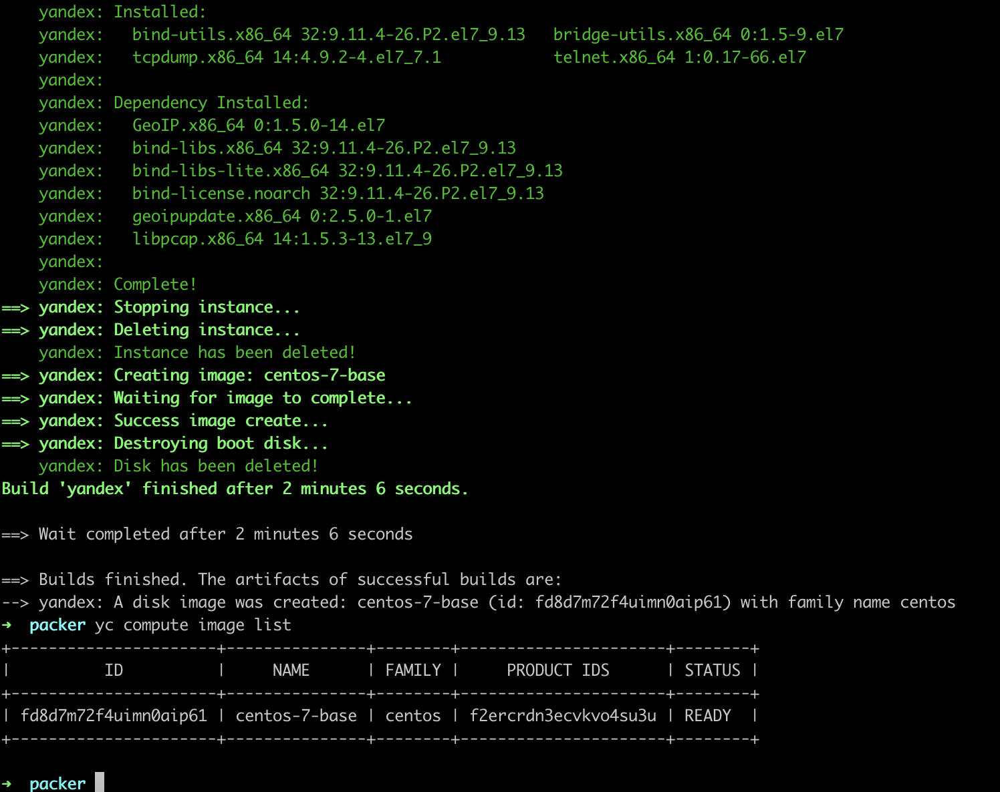
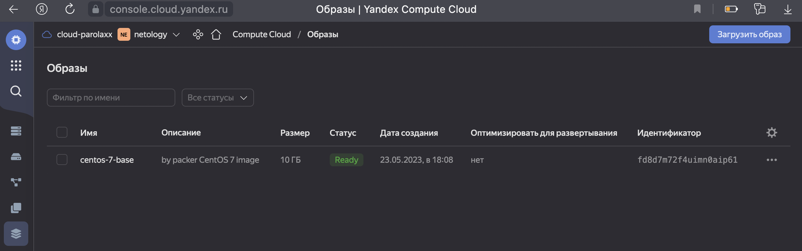
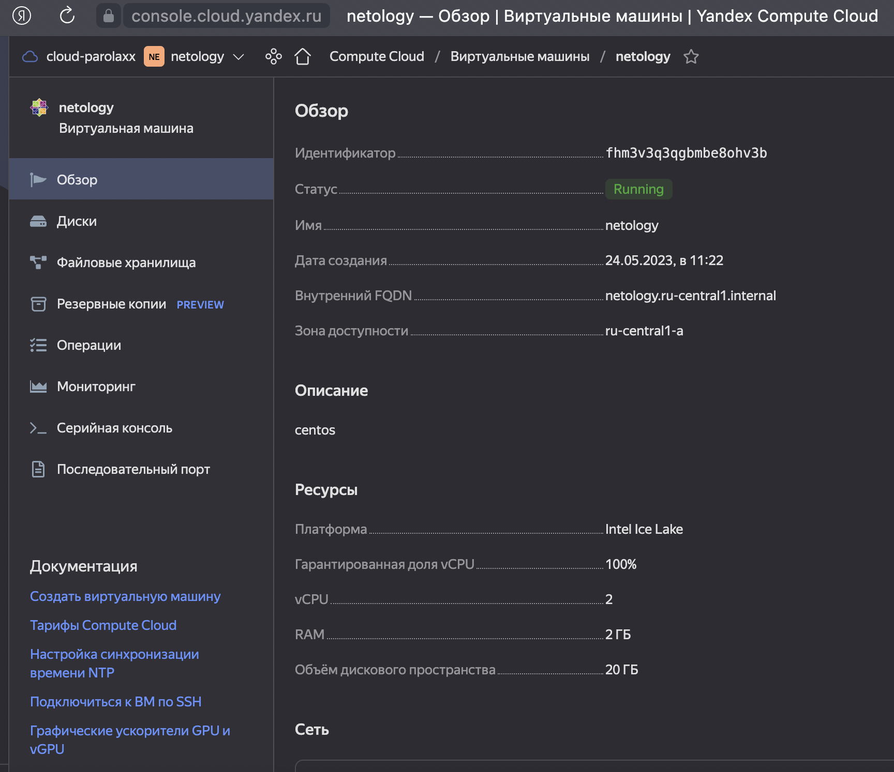
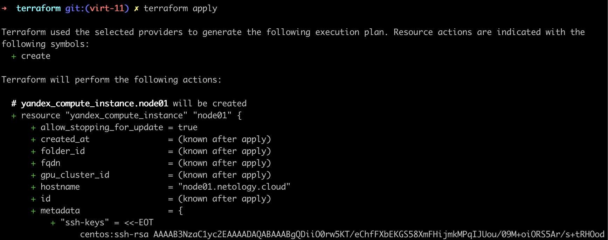
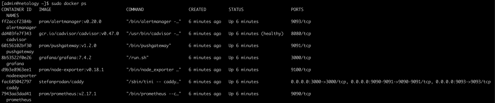
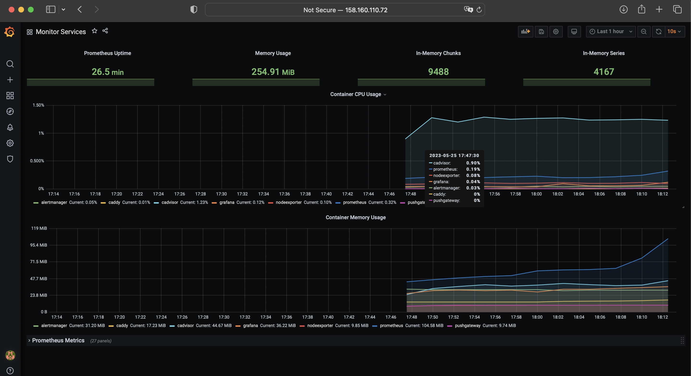

Домашнее задание к занятию 4. «Оркестрация группой Docker-контейнеров на примере Docker Compose»

1. Задача
Создайте собственный образ любой операционной системы (например ubuntu-20.04) с помощью Packer (инструкция).

2. Задача
2.1. Создайте вашу первую виртуальную машину в YandexCloud с помощью web-интерфейса YandexCloud.

2.2.* (Необязательное задание)
Создайте вашу первую виртуальную машину в YandexCloud с помощью Terraform (вместо использования веб-интерфейса YandexCloud). Используйте Terraform-код в директории (src/terraform).

3. Задача
С помощью Ansible и Docker Compose разверните на виртуальной машине из предыдущего задания систему мониторинга на основе Prometheus/Grafana. Используйте Ansible-код в директории (src/ansible).

4. Задача
Виртуальная машина: мониторинг Grafana с текущими метриками

