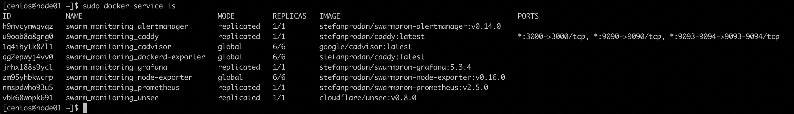
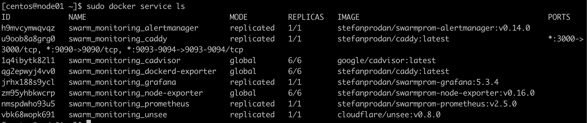

# Домашнее задание к занятию 3. «Введение. Экосистема. Архитектура. Жизненный цикл Docker-контейнера»

1. Задача 1
  * В чём отличие режимов работы сервисов в Docker Swarm-кластере: replication и global?
    - Отличие между режимами работы сервисов в Docker Swarm-кластере заключается в том, что режим replication запускает несколько реплик сервиса на различных узлах кластера, а режим global запускает одну реплику сервиса на каждом узле кластера.
  * Какой алгоритм выбора лидера используется в Docker Swarm-кластере?
    - В Docker Swarm-кластере используется алгоритм выбора лидера Raft. В кластере Docker Swarm каждый узел имеет свой экземпляр Raft, который обменивается сообщениями с другими узлами, чтобы достичь консенсуса и выбрать лидера. Лидер управляет состоянием кластера, принимает решения о добавлении и удалении узлов, а также распределяет задачи между узлами. Если лидер отказывает, то выбирается новый лидер с помощью алгоритма Raft. 
  * Что такое Overlay Network?
    - Overlay Network (сеть наложения) - это виртуальная сеть в Docker, которая позволяет соединять контейнеры на разных хостах в единую сеть. Overlay Network используется для связи контейнеров в Docker Swarm-кластере и обеспечивает автоматическое маршрутизацию трафика между контейнерами.

2. Задача 2
  Создайте ваш первый Docker Swarm-кластер в Яндекс Облаке.
  
3. Задача 3
  Создайте ваш первый, готовый к боевой эксплуатации кластер мониторинга, состоящий из стека микросервисов.
  