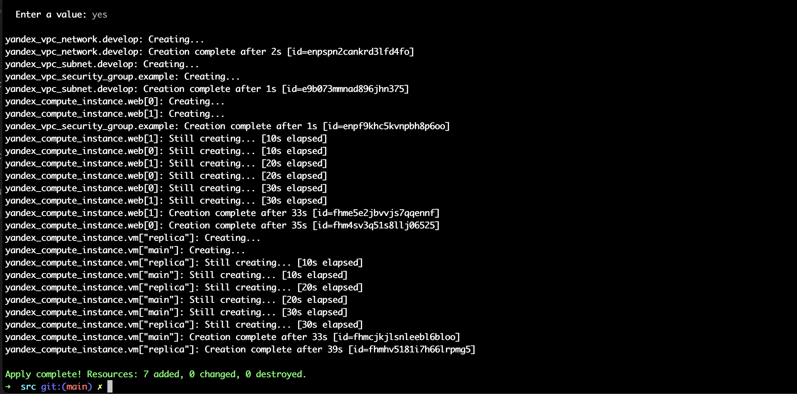

Домашнее задание к занятию "Управляющие конструкции в коде Terraform"

1. Задание

Изучите проект.
Заполните файл personal.auto.tfvars
Инициализируйте проект, выполните код (он выполнится даже если доступа к preview нет).
Примечание: Если у вас не активирован preview доступ к функционалу "Группы безопасности" в Yandex Cloud - запросите доступ у поддержки облачного провайдера. Обычно его выдают в течении 24-х часов.

Приложите скриншот входящих правил "Группы безопасности" в ЛК Yandex Cloud или скриншот отказа в предоставлении доступа к preview версии.

2. Задание

3. Задание

4. Задание

