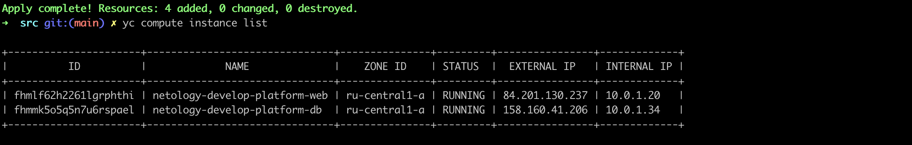

Домашнее задание к занятию «Основы Terraform. Yandex Cloud»

1. Задание
   4. Инициализируйте проект, выполните код. Исправьте возникшую ошибку. Ответьте в чем заключается ее суть?
   - Указанные значения кол-ва ядер и оперативной памяти меньше минимума (указано 1, 1, при минимуме 2, 2)
   5. Ответьте, как в процессе обучения могут пригодиться параметры preemptible = true и core_fraction=5 в параметрах ВМ? 
   - Параметр preemptible = true в параметрах виртуальной машины означает, что создаваемая виртуальная машина будет временной и может быть прервана провайдером в любой момент времени. 
   - При установке core_fraction в значение 5 будет зарезервировано 5% от общего количества ресурсов
   
- скриншот ЛК Yandex Cloud с созданной ВМ

- скриншот успешного подключения к консоли ВМ через ssh

2. Задание
   - Заменил переменными, terraform plan

3. Задание
   - Скопируйте блок ресурса и создайте с его помощью вторую ВМ(в файле main.tf): "netology-develop-platform-db" , cores = 2, memory = 2, core_fraction = 20. Объявите ее переменные с префиксом vm_db_ в том же файле('vms_platform.tf').

4. Задание
   Объявите в файле outputs.tf output типа map, содержащий { instance_name = external_ip } для каждой из ВМ.
   Примените изменения.
   В качестве решения приложите вывод значений ip-адресов команды terraform output

5. Задача
   В файле locals.tf опишите в одном local-блоке имя каждой ВМ, используйте интерполяцию ${..} с несколькими переменными по примеру из лекции.
   Замените переменные с именами ВМ из файла variables.tf на созданные вами local переменные.
   Примените изменения.
   https://github.com/parolax/devops-netology/blob/terraform-02/terraform.yandex_cloud/src/locals.tf

6. Вместо использования 3-х переменных ".._cores",".._memory",".._core_fraction" в блоке resources {...}, объедените их в переменные типа map с именами "vm_web_resources" и "vm_db_resources".
Так же поступите с блоком metadata {serial-port-enable, ssh-keys}, эта переменная должна быть общая для всех ваших ВМ.
Найдите и удалите все более не используемые переменные проекта.
Проверьте terraform plan (изменений быть не должно).
- https://github.com/parolax/devops-netology/blob/terraform-02/terraform.yandex_cloud/src/main.tf
- https://github.com/parolax/devops-netology/blob/terraform-02/terraform.yandex_cloud/src/variables.tf
