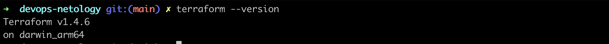
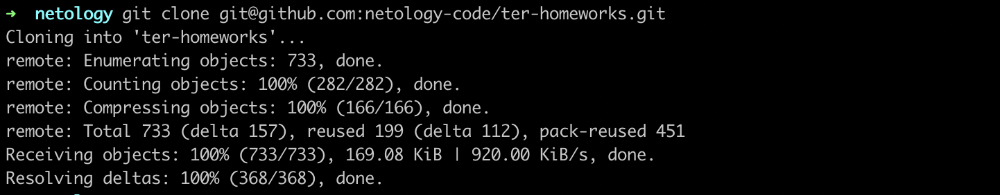
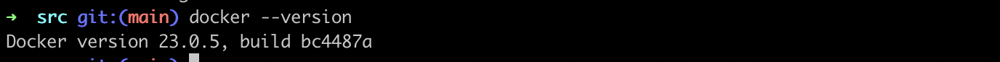
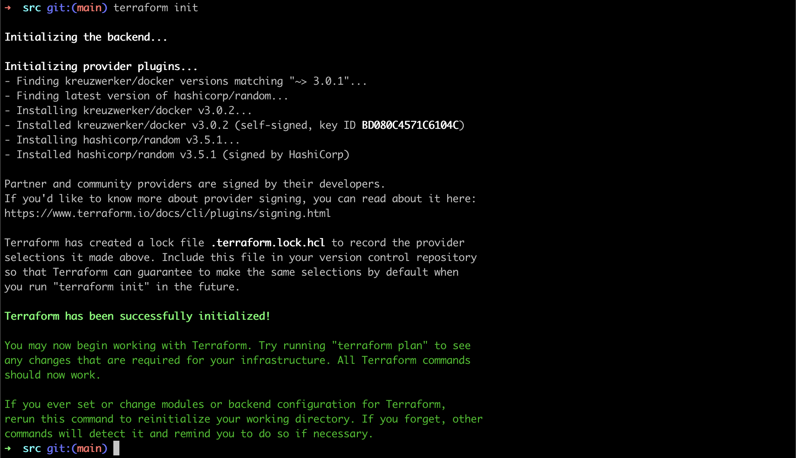
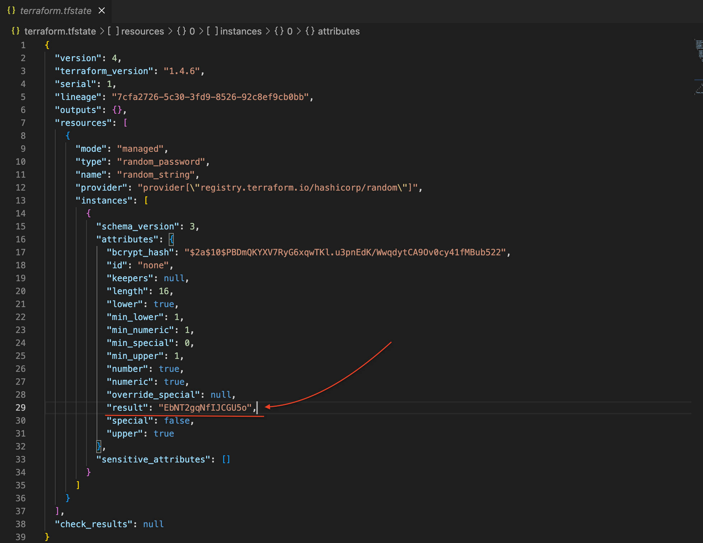
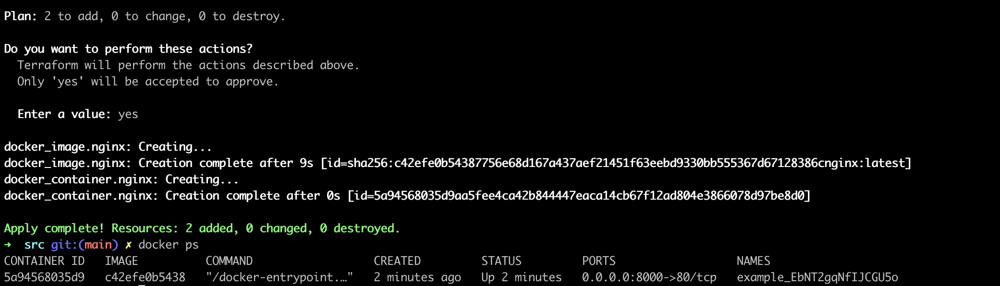
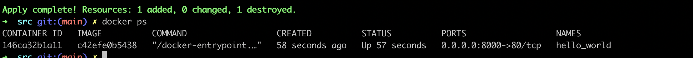
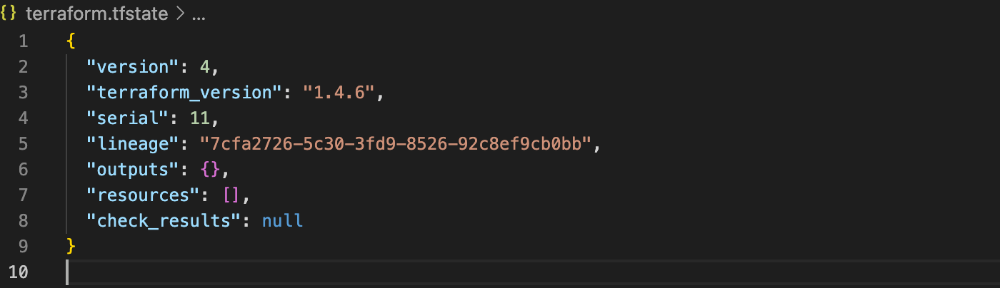

Домашнее задание к занятию «Введение в Terraform»

Чеклист готовности к домашнему заданию:

1. Скачайте и установите актуальную версию terraform >=1.4.0 . Приложите скриншот вывода команды terraform --version.

2. Скачайте на свой ПК данный git репозиторий. Исходный код для выполнения задания расположен в директории 01/src.

3. Убедитесь, что в вашей ОС установлен docker.

Задание 1
  1. Перейдите в каталог src. Скачайте все необходимые зависимости, использованные в проекте.

  2. Изучите файл .gitignore. В каком terraform файле согласно этому .gitignore допустимо сохранить личную, секретную информацию?
     - Согласно файлу .gitignore секретная информация в переменных может хранииться в файле personal.auto.tfvars
  3. Выполните код проекта. Найдите в State-файле секретное содержимое созданного ресурса random_password, пришлите в качестве ответа конкретный ключ и его значение.

  4. Раскомментируйте блок кода, примерно расположенный на строчках 29-42 файла main.tf. Выполните команду terraform validate. Объясните в чем заключаются намеренно допущенные ошибки? Исправьте их.
     - Все блоки ресурсов обязательно должны иметь 2 лейбла: имя и тип. В раскоменченных строках в первом случае не указано имя. Во втором в имени допущена ошибка, имена должны начинаться с буквы или _
     - У ресурса, лишнее в имени "random_string~~_fake~~" и допушена ошибка в слове "result"
  5. Выполните код. В качестве ответа приложите вывод команды docker ps 

  6. Замените имя docker-контейнера в блоке кода на hello_world, выполните команду terraform apply -auto-approve. Объясните своими словами, в чем может быть опасность применения ключа  -auto-approve ? В качестве ответа дополнительно приложите вывод команды docker ps
     - -auto-approve принудительно подтверждает все изменения, которые Terraform планирует применить к инфраструктуре. Terraform не будет запрашивать у пользователя подтверждение каждого изменения в интерактивном режиме. Вместо этого Terraform автоматически применит все изменения, которые были определены в файле конфигурации.

  7. Уничтожьте созданные ресурсы с помощью terraform. Убедитесь, что все ресурсы удалены. Приложите содержимое файла terraform.tfstate.

  8. Объясните, почему при этом не был удален docker образ nginx:latest ? Ответ подкрепите выдержкой из документации провайдера.
     - Докер образ не был удалён, потому что при создании, в определении ресурса указан параметр keep_locally, со значеним true. Значение false удаляет образ. 